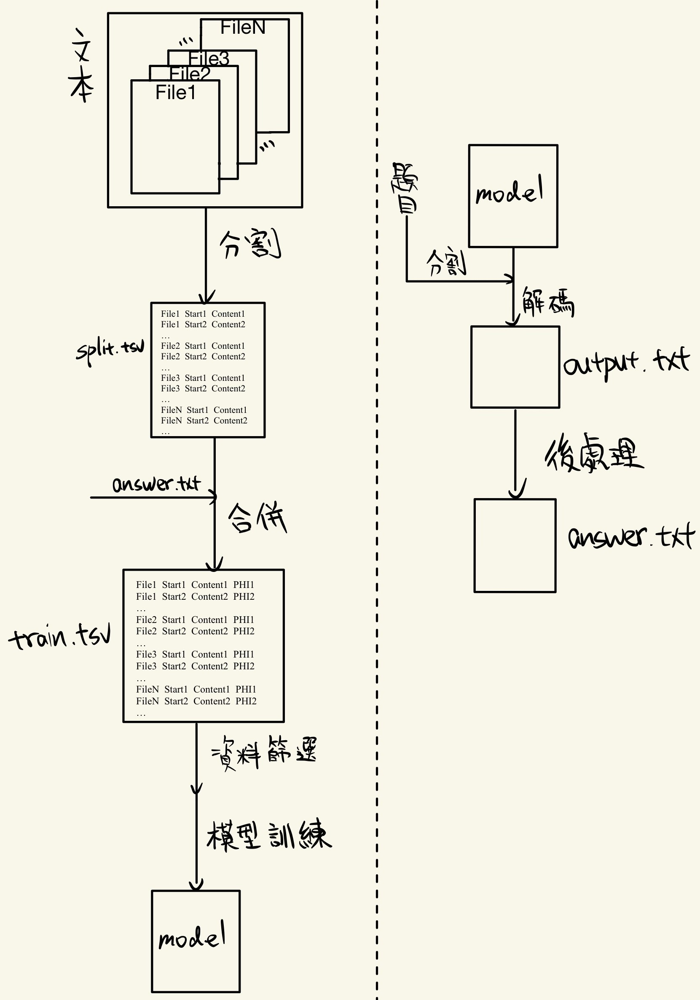

# AICUP

Description


<!-- PROJECT LOGO -->
<br />

<p align="center">
  <h3 align="center">隱私保護與醫學數據標準化競賽</h3>
  <p align="center">
    怎麼這麼複雜 好想睡覺
    <br />
    <a href="https://github.com/c110154213/ai_cup.git"><strong>探索本專案的文檔 »</strong></a>
    <br />
    <br />
    <a href="https://github.com/your_github_name/your_repository">查看Demo</a>
    ·
    <a href="https://github.com/your_github_name/your_repository/issues">報告Bug</a>
    ·
    <a href="https://github.com/your_github_name/your_repository/issues">提出新特性</a>
  </p>

</p>


 本篇README.md面向開發者
 
## 目錄

- [上手指南](#上手指南)
  - [開發前的配置要求](#開發前的配置要求)
  - [安裝步驟](#安裝步驟)
- [檔目錄說明](#檔目錄說明)
- [開發的架構](#開發的架構)
- [部署](#部署)
- [使用到的框架](#使用到的框架)
- [版本控制](#版本控制)

### 上手指南

請參考[上手指南](上手.md)


###### 開發前的配置要求

1. colab沒被封就可以


###### **安裝步驟**

1. 上傳分割/合併/篩選/模型訓練/解碼/後處理程式到Colab
2. 上傳訓練集/驗證集

```sh
git clone https://github.com/your_github_name/your_repository.git
```

### 檔目錄說明
eg:

```
filetree 
├── ARCHITECTURE.md
├── LICENSE.txt
├── README.md
├── /account/
├── /bbs/
├── /docs/
│  ├── /rules/
│  │  ├── backend.txt
│  │  └── frontend.txt
├── manage.py
├── /oa/
├── /static/
├── /templates/
├── useless.md
└── /util/

```


### 開發的架構 

<p align="center">
  

### 部署

暫無

### 使用到的框架

- [xxxxxxx](https://getbootstrap.com)
- [xxxxxxx](https://jquery.com)
- [xxxxxxx](https://laravel.com)


### 版本控制

該專案使用Git進行版本管理。您可以在repository參看當前可用版本。

### 作者

c110154213@nkust.edu.tw


c110154221@nkust.edu.tw

 *您也可以在貢獻者名單中參看所有參與該專案的開發者。*

### 版權說明

該項目簽署了MIT 授權許可，詳情請參閱 [LICENSE.txt](https://github.com/your_github_name/your_repository/blob/master/LICENSE.txt)


