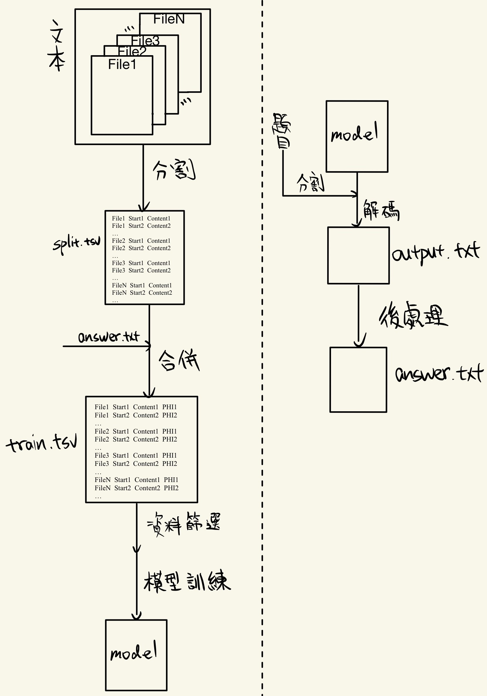

本專案分成兩種架構

訓練  解碼

訓練由 分割/合併/資料篩選/訓練模型結合而成

解碼由 分割/解碼/後處理結合而成

訓練:

獲得訓練集資料後，透過分割，輸出分割檔，在與answer.txt使用合併，輸出訓練集

資料篩選為，只要PHI值為"PHI: NULL"，則刪除，本程式只保留含有隱私資訊之行

整理好訓練集之後即可使用訓練模型，請保存模型與分詞器

解碼:

獲得驗證集資料後，透過分割，輸出分割檔

使用解碼，將訓練好的模型、分詞器、分割檔載入

輸出在經由後處理即可獲得answer.txt

程式請參考[程式說明](程式說明.md)

  
